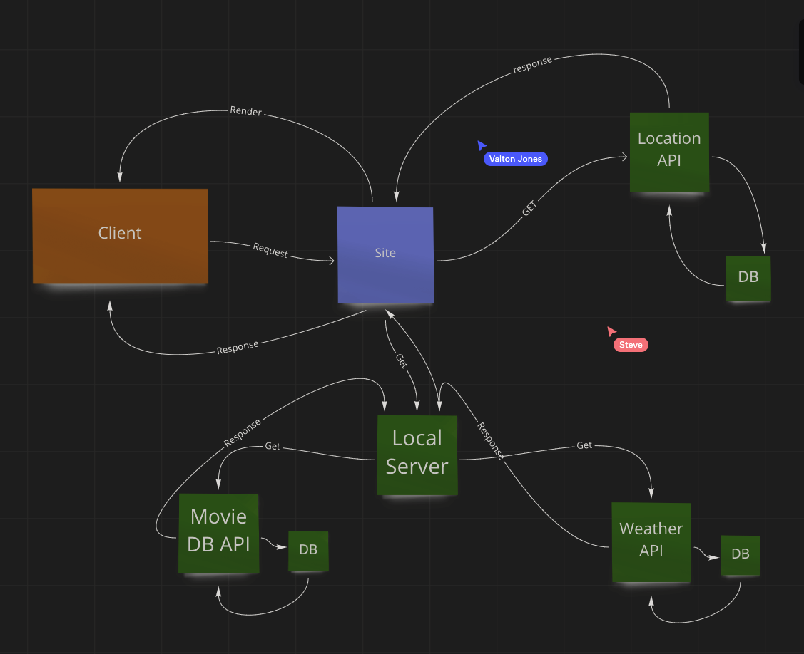

# City Explorer

**Author**: David Hecker
**Version**: 1.0.0 (increment the patch/fix version number if you make more commits past your first submission)

## Overview
<!-- Provide a high level overview of what this application is and why you are building it, beyond the fact that it's an assignment for this class. (i.e. What's your problem domain?) -->

Allow the user to input a city name and receive data about the city

## Getting Started
<!-- What are the steps that a user must take in order to build this app on their own machine and get it running? -->

- 
- 
- 

## Architecture
<!-- Provide a detailed description of the application design. What technologies (languages, libraries, etc) you're using, and any other relevant design information. -->

## Change Log
<!-- Use this area to document the iterative changes made to your application as each feature is successfully implemented. Use time stamps. Here's an example:

01-01-2001 4:59pm - Application now has a fully-functional express server, with a GET route for the location resource. -->

Name of feature: Locations: As a user of City Explorer, I want to enter the name of a location so that I can see the exact latitude and longitude of that location.

Estimate of time needed to complete: 2 hours

Start time: 1620

Finish time: 1800

Actual time needed to complete: 1 hour 40 minutes

<!--  -->

Name of feature: Map: As a user, I want to see a map of the city so that I can see the layout of the area I want to explore.

Estimate of time needed to complete: 2 hours

Start time: 1810 / 1945

Finish time: 1915 / 2005

Actual time needed to complete: 1 hour 25 minutes

<!--  -->

Name of feature: Errors: As a user, I want clear messages if something goes wrong so I know if I need to make any changes or try again in a different manner.

Estimate of time needed to complete: 1 hour

Start time: 2010

Finish time: 2030

Actual time needed to complete: 20 minutes

<!-- Lab 7 -->

Name of feature: Weather (placeholder): As a user of City Explorer, I want to see weather info for the city I searched, so that I know how to pack for an upcoming trip.

Estimate of time needed to complete: 2 hours

Start time: 1600 / + 1 day 1730

Finish time: 2000 / + 1 day 1845

Actual time needed to complete: ~ 5 hours

Name of feature: Errors (revisited): As a user, I want clear messages if something goes wrong so I know if I need to make any changes or try again in a different manner.

Estimate of time needed to complete: 2 hours

Start time: 

Finish time:

Actual time needed to complete:

<!--  Lab 8 -->

Name of feature: Weather (live): As a user of City Explorer, I want to see weather info for the city I searched, so that I know how to pack for an upcoming trip.

Estimate of time needed to complete: 2 hours

Start time: 1850

Finish time: 2000

Actual time needed to complete: ~ 1 hour

## Credit and Collaborations
<!-- Give credit (and a link) to other people or resources that helped you build this application. -->
- Pair programmed 9/20/21 with Cameron Walden, covering the WRRC
- Pair programmed 9/21/21 with Jacob Gregor, covering the server flow chart
- Pair programmed 9/22/21 with Valton Jones and Steve Ngo, updated the server flow chart and reviewed code
- Assisted by Sara Russert on 9/22/21, fixed weather data rendering issue
